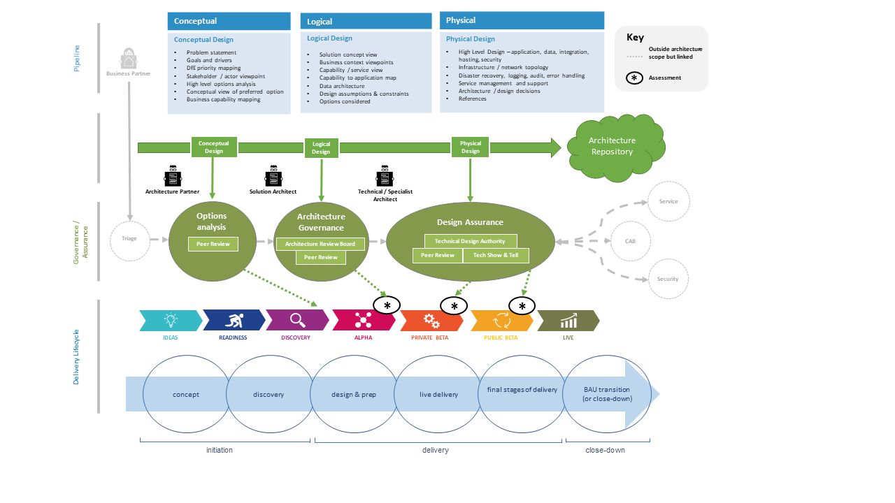

# Design assurance

> DfE Architecture is moving to a more profession-led model. This content is under review. Contact the [architecture profession](mailto:architecture.profession@education.gov.uk) for more information.

## In-line assurance

We have different ways of delivering services in DfE. How we assure technical design meets the necessary standards needs to be flexible.
We need to ensure we're doing the right things (governance) and doing things right (assurance). And not slowing down delivery in the process.

The SRO or Service Owner (usually a Deputy Director) is accountable for all delivery within their service, programme or division. They rely on the advice of technical experts within their multi-disciplinary teams and portfolios when taking ownership of key technical designs for their domain - the 'in-line' assurance model.

Groups of accountable people (such as the Digital and Technology Senior Leadership Team or Service Owner community) are collectively accountable for all key technical decisions across the organisation, ensuring all cross-divisional or cross-functional impacts are considered.

We encourage an 'in-line' assurance model for architecture and technical design. You can read more about the evolving in-line assurance model and where this has been adopted or is being tested.

 ## Design assurance in delivery teams

 We expect architectures will emerge and evolve over time, as services themselves change based on emerging user needs and other drivers, such as policy changes.

 This requires ongoing and continuous review of architecture and technical design, to ensure services are being built sustainably and consistently, both across the service area and also the wider organisation.

 Embedded architects work closely with their delivery teams to facilitate this, alongside product managers, developers and other people. They also work alongside their lead/principal architect, who may cut across multiple services, to ensure breadth and consistency in their designs.

 Architects have access to a plethora of design skills and experience from across professional communities in DfE. They can use architecture community meet-ups ( link) to ask for help with design problems, or ask the architecture profession to help facilitate a peer review (link) of their design. Many permanent architects have professional objectives that include supporting others in the community with peer review and preparation for service assessment.

 ## Things to help you

 ### Peer review

 The architecture profession can help you find the right people to review your design and provide helpful, constructive advice, whatever your stage of delivery. This could be early on when you're thinking about the problem space and options, or later on, when you have physical design.

 Typically, you'd have a design and some narrative documented to share in advance of the session - this could be in a form of a passport, design pack or links to technical documentation on your repository/wiki. This gives reviewers the opportunity to understand the context and think of any burning questions about your design beforehand.

 During the session, you'll walk through key points of your design, seek and discuss feedback. It should be an open, honest and constructive conversation, amongst trusted peers. You'll be expected to make notes yourself and summarise these (and any actions) back to the group. For particularly large or complex designs, the profession may be able to provide facilitation/secretariat support.

 After the session, the profession will record any significant or cross-cutting architecture decisions and actions, and follow these up.

- [Design pack, with example diagrams](../documents/design-pack.docx)
- [Design pack, text only](../documents/design-pack-just-text.docx)

A design pack provides an overview of the scope, deliverables and complexities of implementing change in an IT system landscape. It should provide enough information for all interested or required parties to understand the changes needed and any new or improved functionality which the change will deliver. It should be useful in any delivery context, be that a digital, data or technology service.

Above all, a design pack should move the design process forward, enabling effective review and assurance of impending change. It should be a living, breathing artefact that is continually updated by the project or service team, in collaboration with an Architecture Lead.

It is important to remember that this document should be used as a template and adapted as necessary. Only certain views are necessary in order to ensure effective governance and assurance against IT strategy and technical standards.  

You must discuss the development of a design pack with your [Architecture Lead](../../profession/our-profession-offer/#architecture-leads) and adapt appropriately.

## Our boards and assurance forums

We provide governance and assurance of architecture and design at the conceptual, logical and physical stages.

### Conceptual options and design peer review
All programmes / projects should complete a conceptual design pack (including options analysis) which will be peer reviewed by at least two Enterprise Architects and relevant stakeholders. Any resulting decisions and actions will be logged on the Architecture RAID log and added to the weekly architecture communications.

### Logical design assurance
Your [Architecture Lead](../../profession/our-profession-offer/#architecture-leads) will work with you to confirm if any architecture change is significant (novel or contentious) and should therefore be reviewed at ARB, or if a peer review is sufficient.

#### Architecture Review Board (ARB)
The ARB is the central architecture governance board for significant architecture change. Its scope includes DfE's Executive Agencies and, where appropriate, Arms Length Bodies (ALBs).

To attend ARB you should complete and submit an ARB passport. This helps lead the discussion at the board and a design pack with the conceptual/ logical design sections completed.

- [ARB passport](../documents/arb-passport.vsdx)
- [Design pack, with example diagrams](../documents/design-pack.docx)

The board's purpose is to:​

- Make enterprise-level decisions that are aligned with DfE and Data, Digital and Technology strategies and standards
- Inform and assure digital, data and technology choices
- Maintain oversight of design assurance through service delivery
- Break down siloed working to bring about consistency and clarity in design

#### Peer review (logical)
This is arranged by the architecture practice for projects where the architecture change is minimal.

A design pack with the conceptual / logical design sections completed is required.

### Physical design assurance
Physical design assurance ensures proportionate review of your technical designs takes place. Your [Architecture Lead](../../profession/our-profession-offer/#architecture-leads) will work with you to agree the most appropriate route to review and endorse your physical design, which may involve one or more of the following activities:

#### Technical Design Authority (TDA)
TDA considers and approves physical designs. The membership includes architects and technical specialists from different domains, including representation from IT Security Assurance, Cloud Operations and IT Service Management.

To attend TDA, you must submit a completed [security checklist](../documents/security-checklist.xlsx) and a [design pack](../documents/design-pack.docx) with the conceptual, logical and physical design sections completed.

#### How to engage the TDA

- You will need to complete a Design pack (Physical views)
- You will need to complete the TDA Security Checklist

You will need to answer the following questions:
- Will the solution be hosted in the cloud? If so, has your submission been reviewed by the Cloud Infrastructure Platform (CIP) team?   (Provide name)
          - Have you considered the longer term hosting costs, across all environments? Have these cost been endorsed by the CIP team?

 - What is the Total Costof Ownership (TCO) for this service? (Delivery plus on-going operational costs from discovery to live)
         - Is this affordable?

 - Is there a support model in place to avoid creating long term reliance on specific individuals?
 - What potential commoncomponents will this solution create for reuse across other parts of DfE and government?
 - Send this to your Architecture Lead for peer review. They will confirm when and if this should be reviewed by TDA.
 - When the Architecture Lead confirms, send your submission, security checklist and the answers to the questions above to the Architecture Profession mailbox by 09:00am Monday, for consideration at the Wednesday session.

#### Technical Show and Tells
It may be more appropriate for your project to bring architects and team members together for a technical Show and Tell. These are a great way to provide support, challenge and design assurance in a less formal setting. As with other assurance activities, any resulting decisions and actions will be logged on the Architecture RAID log and added to the weekly architecture communications.

#### Peer review (physical)
If there is a very minor change to a design or the solution is not complex, then a peer review with architects and technical specialists may be a more appropriate way of reviewing the change. Your [Architecture Lead](../../profession/our-profession-offer/#architecture-leads) will help ensure this takes place.

## Further guidance

For more information on architecture governance or design assurance, contact the [architecture profession](mailto:architecture.profession@education.gov.uk)
