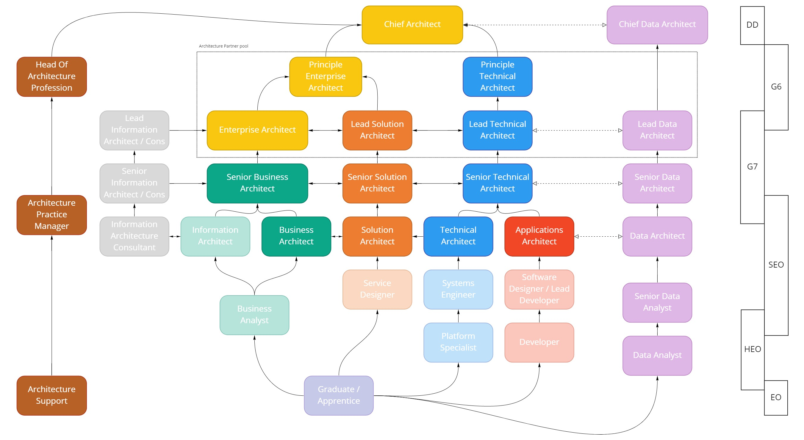

# Architecture Capability Framework

> This page is being drafted, but we wanted to share the information we'd gathered as soon as it was available. If you have any comments, please contact the [architecture profession](mailto:architecture.profession@education.gov.uk))

## Purpose
This framework provides an outline of the roles, skills and experience that architects working within DfE have or would like to build.

It describes the pathways into architecture and how to develop an architecture career. It should help also people interacting with architects understand what we do and how we do it.

It builds on the [GOV.UK DDaT Capability Framework](https://www.gov.uk/government/collections/digital-data-and-technology-profession-capability-framework), extending the various skills, levels and mastery for the context of DfE.

## The role of an architect through the delivery lifecycle
|     | Planning | Discovery | Alpha | Beta | Live |
|-----|----------|-----------|-------|------|------|
| **Questions to answer** | What is the problem space? Is there a problem to solve? | What is the problem? How big is it? Can we solve it? | What are our risky assumptions? How can we release value early? | What should we build first and is it adding value? | How can we continually add value to the service?|
| **Things an architect might focus on** | Problem framing, stakeholder mapping, input to business case | Problem statement, goals and drivers, conceptual views, business/technical capability mapping, early option thinking | Solution prototyping, capability / service / application views, data architecture, design assumptions and constraints, options considered / tested | High > low level design (applications, data, integration, hosting, security), infrastructure / network topology, disaster recovery, logging, auditing, error handling, managing the service and support, architecture / design decisions | Continual improvement, relationships with suppliers, learning/future recommendations|

## The skills and experience you'll need
In DfE, we have a mix of enterprise, solution, technical and data architects. We also have tech leads and a Head of Profession - there are lots of different roles and teams that do architecture in one way or another, across a number of business areas.

Here are some of the more common roles:

### Enterprise Architects

Enterprise Architects generally work across the DfE at a strategic level, to translate business strategy into change and technical delivery.

Their responsibilities include:

- establishing broad architectural principles, policies and standards
- assuring technology decisions are aligned to architecture and technical strategies
- ownership of architecture strategy and roadmaps for the organisation, including ‘as-is’ and ‘to-be’ transitional states
- understanding DfE's ecosystem and its inter-dependencies

### Solution Architects

Solution Architects typically work within delivery teams to find the best use of data, applications and technology for the design and delivery of services and products. Whilst also helping to deliver business change and achieving organisational objectives.

Solution Architects generally own the overall technical vision for a solution or set of solutions. They work within delivery teams to assure the implementation and delivery of those solutions.

### Technical Architects

Technical Architects are embedded within a multi-disciplinary team, working end-to-end to help to design and implement technical solutions. They are often specialists or technical subject matter experts in one or more disciplines (e.g. software development, data, security, DevOps). They mostly work in continuous delivery environments and are comfortable with turning business problems into technical design. They are often from a software development or engineering background, and are comfortable using a variety of technical tools and working with code.

The role is aligned with the [Technical Architect](https://www.gov.uk/guidance/technical-architect) job role on the GOV.UK DDaT Capability Framework.

*[Add read across with DDaT Tech Arch skill levels, standard job descriptions]*

### Specialist Architects

We also have [Data Architects](https://www.gov.uk/government/publications/data-architect-role-description/data-architect-role-description)
and other [Specialist Technical Architects](https://www.gov.uk/government/publications/technical-specialist-architect-role-description/technical-specialist-architect-role-description) (focused on things like security or networks, for example), who work closely with service delivery teams and the other parts of the department to help achieve our goals.

### Profession support

We also have an architecture practice and community manager and some professional support, to keep everything running smoothly in the profession.

## Things to help you
### Responsibilities
Here are some examples of the expected responsibilities at different levels:

| | G6 Lead Architect | G7 Senior Architect | SEO Architect
- | - | - | -
__Delivery__ | Across one or more portfolios or business domains | Across a programme or group of projects, aligned to a portfolio or domain | Across one or a small group of projects, aligned to a portfolio or domain
__Assurance__ | Review of business cases, establish in-line assurance mechanisms, reviewing submissions for assurance, technical service assessment, design assurance of major/critical programmes | Establish/support assurance mechanisms, assurance submissions, technical service assessment, design assurance of projects and programmes | Participate in assurance mechanisms, technical service assessment, design assurance of projects
__Strategies__ | Own one or more technology strategies and roadmaps | + One or more technology strategies and roadmaps |
__Thought leadership__ | Write thematic papers to influence, lead community discussions | + Write thematic papers to influence, lead community discussions |
__Line management__ | Team plans and management, workforce management | + Management and coaching of colleagues |
__Corporate__ | Budget delegation, leading cross-cutting work, mentoring, recruitment, xGovernment collaboration | + Cross-cutting work (actively involved), mentoring, recruitment, xGovernment collaboration | + Recruitment, xGovernment collaboration

(+ indicates a stretch goal)

Architects (or those aspiring to be architects) should consider:

- Which level am I operating at?
- What else could / should I do?
- How can I create space to cover?
- What support do I need?

*[Add examples for other architect roles]*

### Objectives
*[Add standard deliverables, expectations]*

### Learning and development
*[Add offer, recommended learning, shadowing / mentoring, how to access]*

### Community

There is a thriving architecture community in DfE. We meet up monthly, to 'show and tell' good things that are happening in architecture and hear from wider Government, private sector, relevant suppliers and vendors on new, innovative solutions. And to just chat and share knowledge. You don't have to be an architect to join in - we often hear updates from business areas and those interested in what we're doing. If you want to get involved or have something to share, drop us a line in the [architecture profession](mailto:architecture.profession@education.gov.uk).

And join us on the following channels:

- [#architecture](https://ukgovernmentdfe.slack.com/archives/CFGA9DZSL) channel on [DfE Slack](https://ukgovernmentdfe.slack.com)
- [#architecture](https://ukgovernmentdigital.slack.com/archives/C04V6F4SX) channel on [UK Government Slack](https://ukgovernmentdigital.slack.com)
- [Architecture Community on Teams](https://teams.microsoft.com/l/team/19%3a431430007aba4eceaddb4a0ab32dc412%40thread.skype/conversations?groupId=a7bd5aaa-9b44-4594-b058-4ac717af83d9&tenantId=fad277c9-c60a-4da1-b5f3-b3b8b34a82f9)

## Pathways into architecture
Here are some examples of how architects come into the profession and what the career pathways might look like:

You can also download a [PDF version](../documents/dfe-architecture-framework-pathways.pdf) of this architecture pathway map.

*[Add detail on DDaT pathways + DfE - from business analysis, development / DevOps, technnical roles]*

## Profiles
*[Add case studies for Enterprise / Solution / Technical Architect]*

For more information, or for help finding an architect for your project, contact the [architecture profession](mailto:architecture.profession@education.gov.uk)
