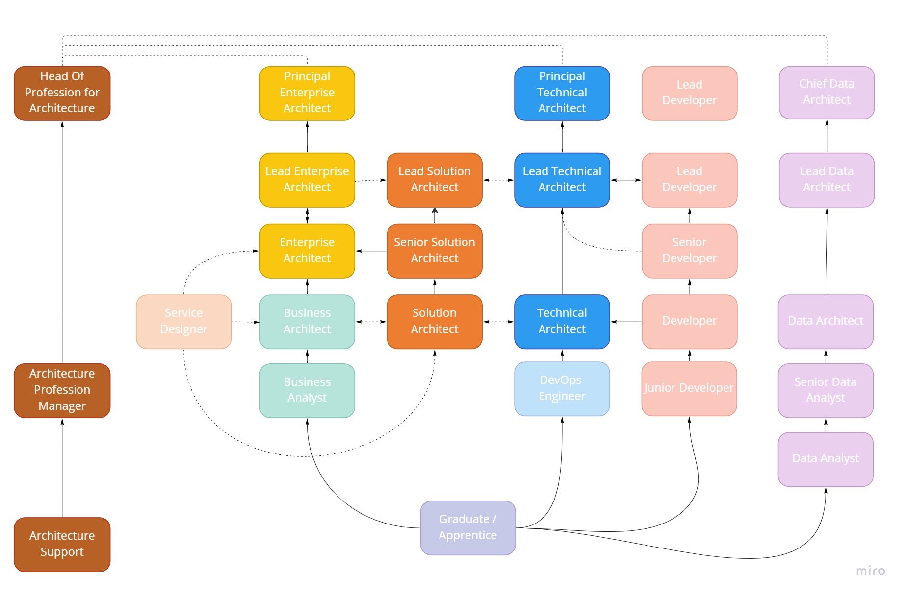

# Architecture Capability Framework

(Note - this page is being drafted)

## Purpose
This framework provides an outline of the roles, skills and experience that architects working within DfE have or would like to build.

It describes the pathways into architecture and
how to develop an architecture career. It should help also people interacting with
architects understand what we do and how we do it.

It builds on the [GDS DDaT Capability Framework](https://www.gov.uk/government/collections/digital-data-and-technology-profession-capability-framework),
extending the various skills, levels and mastery for the DfE context.

## The skills and experience you'll need
In the DfE architecture team, we centre on Enterprise and Solution Architects.
We form part of a wider community of architects working across DfE, but have found
that these two roles tend to work best within the central team, working closely
with Technical Architects and those with other specialisms in project or service teams.

We broadly align our roles with the Technical Architect levels in the GDS DDaT Capability Framework:
  * Chief Architect = [Principle Technical Architect](https://www.gov.uk/government/publications/principal-technical-architect-skills-they-need/principal-technical-architect-skills-they-need)
  * G6 Enterprise Architect = [Lead Technical Architect](https://www.gov.uk/government/publications/lead-technical-architect-skills-they-need/lead-technical-architect-skills-they-need)
  * G7 Enterprise / Solution Architect = [Senior Technical Architect](https://www.gov.uk/government/publications/senior-technical-architect-skills-they-need/senior-technical-architect-skills-they-need)
  * SEO Solution Architect = [Technical Architect](https://www.gov.uk/government/publications/technical-architect-skills-they-need/technical-architect-skills-they-need)
  * HEO Associate Architect = [Associate Architect](https://www.gov.uk/government/publications/associate-technical-architect-skills-they-need/associate-technical-architect-skills-they-need)

We use the skills, levels and mastery from the Technical Architect roles and adapt them for our Enterprise and Solution Architect roles.

*[Add read across with DDaT Tech Arch skill levels]*

In the team, we also have [Data Architects](https://www.gov.uk/government/publications/data-architect-role-description/data-architect-role-description)
and [Specialist Technical Architects](https://www.gov.uk/government/publications/technical-specialist-architect-role-description/technical-specialist-architect-role-description),
who work closely with the Data Directorate and Chief Information Security Officer (CISO) function.

We also have an architecture practice manager and some functional support, to keep everything running smoothly.

## Things to help you
### Objectives
*[Add standard deliverables, expectations]*
### Learning and development
*[Add offer, recommended learning, shadowing / mentoring, how to access]*
### Community

There is a thriving architecture community in DfE. We meet up monthly, to Show and Tell good things that are happening in the architecture space and hear from wider Government, private sector, relevant suppliers and vendors on new, innovative solutions. And just chew the fat and share knowledge. You don't have to be an architect to join in - we often hear from other business areas and those interested in what we're doing. If you want to get involved or have something to share, drop us a line in the [Architecture team](mailto:architecture.governance@education.gov.uk).

The conversation continues on the following channels:

- [Architecture Community on Teams](https://teams.microsoft.com/l/team/19%3a431430007aba4eceaddb4a0ab32dc412%40thread.skype/conversations?groupId=a7bd5aaa-9b44-4594-b058-4ac717af83d9&tenantId=fad277c9-c60a-4da1-b5f3-b3b8b34a82f9)
- [#architecture](https://app.slack.com/client/T50RK42V7/CFGA9DZSL) channel on [DfE Slack](https://ukgovernmentdfe.slack.com)
- [#architecture](https://app.slack.com/client/T04V6EBTR/C04V6F4SX) channel on [UK Government Slack](https://ukgovernmentdigital.slack.com)

### Repositories
Review our current repositories for useful artefacts, standards, patterns and designs:

- [DfE SharePoint repo](https://educationgovuk.sharepoint.com/sites/gp/WorkplaceDocuments)
- [ESFA SharePoint repo](https://educationgovuk.sharepoint.com/sites/ops-cto/strategyandarchitecture)
- [DfE Digital Confluence](https://dfedigital.atlassian.net)
- [ESFA Confluence](https://skillsfundingagency.atlassian.net)

We're working on building a DfE Design System (like [Ministry of Justice](https://moj-design-system.herokuapp.com/)) to surface common components and patterns in use across DfE and its ALBs.

In the meantime, have a look at our prototype [Common Components guidance](../common-components).

### Managed services

The Architecture team have a number of compliant commercial routes to market for architecture services. Architecture Partners work with Service Owners and their delivery teams to assess and suggest appropriate use of these commercial routes, enabling them to:
- get the right architecture skills, at the right time, at the right price
- on-board architects into DfE properly, so they understand our ways of working, our common components approach and our governance and assurance framework
- provide oversight and assurance of their outputs and deliverables
- link them into the wider DfE architecture profession and community
- exit them professionally, with appropriate handover and knowledge transfer when their work is complete

If you'd like to know more, contact the contact the [Architecture team](mailto:architecture.governance@education.gov.uk).

## Pathways into architecture

*[Add detail on DDaT pathways + DfE - from business analysis, development / DevOps, technnical roles]*

## Profiles
*[Add case studies for Enterprise / Solution / Technical Architect]*

For more information, contact the [Architecture team](mailto:architecture.governance@education.gov.uk)
