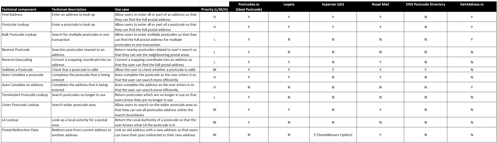

# Common components

## What are common components?

Common components are typically software or technical systems created once and reused many times in different services or business contexts.

Examples include applications, data, a network, security products and hosting. They are like building blocks, typically mapped to a business or technical capability, which can be used to deliver more complex services or systems.

### Key characteristics

Common components can be of any size but they all share the same characteristics. They are:
- designed according to common standards, principles and patterns, with independent quality assurance
- designed and developed in a modular, scalable and resilient way to support ease of reuse and reliability
- mapped to a specific business or technical capability/service. This enables easy search and prevents duplication
- treated as an asset and therefore require support, continuous improvement, enhancement or replacement
- standalone but work alongside other common components, so that a change on one component doesn't affect another

## Why should we use common components?

The adoption of common components can bring significant benefits to the department and help people build better services, more quickly. Some of these benefits are:
- speed to market – reuse can save time to build, test and deliver services. You should not have to build services from scratch every time
- efficiency and reduced costs – the more you can reuse, the more you can save through reduced duplication. This will enable you to focus your efforts on the innovative aspects of the service
- lower risk – building to common standards lowers the risk of failure

## What components are available?

There is a distinction between components used to build a service and tools
to enable the building of services.

### Service components, products and platforms

Domain | Component | Owner | Status
- | - | - | -
Hosting platforms | [Cloud Infrastructure Platform (CIP)](#cip) | Saghir Akbar | Beta
 | [Gov.UK PaaS (in DfE)](#govuk-paas) | Saghir Akbar | Beta
Security and networks | [DfE Sign-in](#dfe-signin) | Jenny O'Connor | Live
| Core network | Saghir Akbar | Live
Integration | [Enterprise API Management (EAPIM)](#eapim) | Saghir Akbar | Beta
Information and data | [Enterprise Data and Analytics Platform (EDAP)](#edap) | Harj Bilan | Beta
| [Postcode lookup](#postcode) | Mario Gledhill | Alpha
| [Geospatial mapping](#mapping) | Mario Gledhill | Alpha
| [Notifications and messaging](#notifications) | tbc | Discovery
Applications | [Content Management Systems ](#cms) | Luke Slowen | Beta
| [Customer Relationship Management](#crm) | Saghir Akbar | Beta
| [Enterprise CRM](#crm) | Saghir Akbar | Beta
| Marketing Automation platform | tbc | Discovery
| Robotic Process Automation (RPA) platform | tbc | Alpha

### Common tooling

Domain | Component | Owner | Status
- | - | - | -
End User Devices | Office 365 | Jenny O'Connor | Live
| Phones and Skype | Jenny O'Connor | Live
| Mobile phones | Jenny O'Connor | Live
Service Operations | Service desk tools (Service Now) | Leanna Green | Live
Digital | Productivity tools (Slack, Trello, Confluence) | Jenny O'Connor | Beta
Development | Development tools (Azure DevOps, Github) | Saghir Akbar | Live
Information and data | SharePoint | Harj Bilan | Live

## How do we use components?

### Cloud Infrastructure Platform
The Cloud Infrastructure Platform (CIP) is the department's Microsoft Azure cloud hosting offer. It’s managed centrally and provides a highly flexible model that gives services control and consistency over how their business services are hosted.

CIP is a set of principles, processes and technologies that support the development and delivery of cloud computing, applications and services.

The CIP platform is designed using a ‘loosely-coupled’ approach, which enables services to be hosted independently from each other. This means changes can be made without affecting other components.

Key benefits include:

- improving efficiency and consistency for delivery teams
- reducing implementation times for projects
- access to best practice templates, automation and customer self-service features
- quick access to a secure 'sandpit' environment

__Documentation__

Read the [platform documentation](https://wa-opscatalogue.azurewebsites.net/) in the service catalogue, that covers security, access, operations and monitoring.

Request CIP access via the [Service Portal](https://dfe.service-now.com/serviceportal?id=sc_cat_item&sys_id=51b0b9c5db1ff7809402e1aa4b96197d&sysparm_category=19d07bc3dbff17003b929334ca9619bd), if you don't already have it.

__Support__

CIP has a support team who handle incidents and requests. Our tiered support operating model makes it easy to accommodate different business requirements. For each service using the platform, a range of support services are provided. All services receive:
- policy support
- guidance for security
- guidance on best practice into production
- working hours support

Optional support services that can be requested during onboarding are:
- support for Azure DevOps for new users
- more extensive support for security / firewalls
- guidance for Azure engineering

We’ve made costing transparent – each service is assigned an ID linked to its Azure account; this makes it simple to track resources being consumed

Read the team's [wiki](https://educationgovuk.sharepoint.com/sites/ciog/groupdelivery/Home.aspx) for further information and ways to contact the CIP Engineering team.

You can raise an [onboarding request](https://dfe.service-now.com/serviceportal?id=sc_cat_item&sys_id=51b0b9c5db1ff7809402e1aa4b96197d&sysparm_category=19d07bc3dbff17003b929334ca9619bd) via the service catalogue.

__Roadmap__

We’ve moved into the continual improvement phase with ongoing effort to improve our hosting offer, products, services and processes. We’re also moving our services away from our legacy cloud platforms on to the Cloud Infrastructure Platform (CIP). Discovery work to migrate to this central strategic platform has begun.

To deliver an enterprise aligned solution to our customer, we will:
1. Create a holistic cloud operating model, meeting the needs of both the DfE and ESFA platform management and service engineering and delivery teams.
2. Create tailored principles and processes, ensuring resources offered directly by the Cloud Hosting provider (Microsoft Azure) are consumed and configured in the desired manner.
3. Define, create, and manage, a selection of services that enable, empower, and protect, delivery teams and the services created by them.
4. Ensure that services offered to the engineering and delivery teams are fit for purpose, fit for use, isolated from one another, and can be easily discovered and consumed by engineering and delivery teams.

To help us deliver the above, we’ve joined forces with the architecture profession to review our cloud strategy. This includes considering how to evolve as a central provider of cloud services and where hot topics like 'multi-vendor' and containerisation fit with our future thinking.

__Further guidance__

Read the [Cloud Infrastructure and Platform Services wiki](https://educationgovuk.sharepoint.com/sites/ciog/groupdelivery/Home.aspx) or contact one of the team:
- Infrastructure Engineering Lead - [Ritesh Patel](https://eur.delve.office.com/?u=f090a9e5-0260-483c-97e2-8b51439ccc92&v=work)
- Infrastructure Operations Lead - [Angie Paylor](https://eur.delve.office.com/?u=7e831e96-5ff2-4f34-8679-aeb58dbbf011&v=work)
- Platform Support Lead - [Paul Cripwell](https://eur.delve.office.com/?u=11bcb046-7de9-4dd9-858d-7997129df02d&v=work)
- Head of Infrastructure Services - [Huw Evans](https://eur.delve.office.com/?u=9d286650-5ffc-4c99-bada-31bcb22cbc10&v=work)

### GOV.UK PaaS
GOV.UK Platform as a Service (PaaS) is a platform developed by Government Digital Service (GDS) and available for government departments to deploy
applications and backend services. It is based on the widely used open source platform Cloud Foundry and built on Amazon Web Services.

It is a simpler alternative to CIP and doesn't require infrastructure specialists to get started.

__Documentation__

Visit the [GOV.UK PaaS technical guidance](https://technical-guidance.education.gov.uk/guides/govuk-paas/) for more information.

### DfE Sign-in
DfE Sign-in is the department’s strategic Identity and Access Management (IdAM) solution. DfE Sign-in already provides IdAM for services migrated from Secure Access and a number of other services that have on-boarded during 2019. All new services should use DfE Sign-in.

DfE Sign-in is an OpenID Connect Identity provider (with support for SAMLp). It is designed to serve as a delegated authority for identity management, harnessing the global experience for all users. The net result is that Service Owners don't need to build identity solutions into their services and service users don't need to maintain many sets of credentials.

Because DfE Sign-in is a standards-based identity provider, integration is simple. Many technologies and frameworks have stable integration components and examples.

__Documentation__

Our service is available at [https://services.signin.education.gov.uk](https://services.signin.education.gov.uk/)

Please read our [getting started](#) guide.

You may also find the following code repositories for services that use DfE Sign-in useful, along with some example integrations that we have built:
- [Teachers Payment Service](https://github.com/DFE-Digital/dfe-teachers-payment-service) (Ruby on Rails)
-	[Course Directory](https://github.com/SkillsFundingAgency/dfc-coursedirectory) (.NET Core)
-	[Other integration examples](https://github.com/dfe-digital/?utf8=%E2%9C%93&q=example)

__Support__

Support for DfE Sign-in is available through our [help pages](https://help.signin.education.gov.uk/contact). These pages contain useful information for users and approvers on how to use DfE Sign-in. If a user is still having problems, they can submit a support request too.

DfE Sign-in support requests are managed via a dedicated DfE Sign-in service desk where we can monitor and track support requests. That enables us to collect information to help improve the service, highlight any potential service issues and regularly update the help pages to further support our users.

Please direct your users through this support route. If there is anything you would like to discuss or be taken through common issues or regular queries, please contact the Product Owner.

__Roadmap__

You can see [who’s already using DfE Sign-in](https://services.signin.education.gov.uk/). Any staff, provider and citizen services that currently use the Pirean Access: One product will migrate across to DfE Sign-in by July 2020.

A full roadmap of services to be onboarded can be seen below:

__Further guidance__
-	Service Manager - [Jane Ludlow](https://eur.delve.office.com/?u=29a68eae-0685-4e19-af80-e51da80951ae&v=work)
-	Product Owner - [Ilona Posluszny](https://gbr.delve.office.com/?u=40757922-2ddc-4491-ab69-043106176d65&v=work)

### Enterprise API Management
Enterprise integration and API management services make it easier to share data quickly and securely – whether you’re an integration partner, developer, publisher or data consumer.

**Enterprise API Management (EAPIM) Platform**

The EAPIM platform provides a central place to host and discover APIs. It is a secure and fully accredited service that makes it easy to both publish and consume APIs.

EAPIM has been developed using Microsoft Azure’s API gateway, and the solution is deployed within the [CIP hosting platform](#cip) with an expert team supporting the infrastructure.

Here are some of the key benefits:

- **Making it easier to share data**
  - Developers can securely publish their APIs quickly in one place using the developer portal
  - Data consumers can view all the APIs available and request access to data
  - The service scales quickly in response to changing demand
- **Reducing the admin for developer teams**
  - Developers can host their APIs quickly by using automated features to build, test and publish. Features include automated on-boarding, templates, tested global policy controls, and identity and access management
  - Once an APIs is hosted, there’s no need for developers to perform any platform maintenance
  - Security accreditation is already in place
- **Cost savings**
  - EAPIM has a flexible subscription model, which means you won’t pay for more hosting space than you use
  - By moving APIs to EAPIM, we are reducing the number of duplicate API platforms across the estate

__Integration middleware__

In addition to the API platform, integration middleware services are also available. These services use APIs to improve data sharing between multiple systems.

The middleware technology improves access to siloed data and can deliver it between multiple systems in near real-time. By integrating systems in this way, we get better visibility of data, reduce the need to manually input data into multiple systems, increase efficiency and reduce the risk of data error.

__Documentation__

Read the [Operating Model](https://educationgovuk.sharepoint.com/sites/lveesfa00073/API%20Management/Forms/AllItems.aspx?id=%2Fsites%2Flveesfa00073%2FAPI%20Management%2FPlatform%20Documentation%2FService%20Operating%20Model%20%28SOM%29%2FCurrent%20Version&viewid=00000000%2D0000%2D0000%2D0000%2D000000000000) for more information about the solution design, security, availability, support and governance. If you need access to this document, please contact [Matt Morgan](https://eur.delve.office.com/?u=2bea9bd4-72ee-4174-850b-f6531174a2c7&v=work).

__Support__

The service is supported internally by a central team of specialists within the Cloud Infrastructure and Platform Services team. To report an issue with the service, log a ticket via the [Service Portal](https://dfe.service-now.com/serviceportal). The team are available from 08:00 – 22:00 hrs Monday to Friday, excluding UK public holidays.

__Roadmap__

DfE customers already using EAPIM or undergoing a transition to adopt the service include:
-	Finance
-	Better Financial Reporting Programme
-	We’ve also recently integrated ServiceNow and Zendesk with the Enterprise CRM to improve data sharing for the Apprenticeships Service Consolidated Support Team (40 users).

Over the next 18 months, these services are evolving in following key areas:
- Driving adoption
- Onboarding more APIs onto the platform
- Promoting reuse of integration middleware

__Further guidance__

Contact [Sarfraz Malik](https://eur.delve.office.com/?u=8d0b2191-9a02-4a7f-8ad3-9b41ea129354&v=work) to find out more about this solution.

### Enterprise Data and Analytics Platform

The Enterprise Data and Analytics Platform (EDAP) provides the DfE with a strategic and consolidated data management capability. It is an Azure hosted solution fronted by a remote desktop (RD) farm with a range of installed software, including many analytical tools. The Department’s analysts, researchers and data scientists use these tools to analyse data from various data sources. SQL server and a file server complete the platform make-up.

__Documentation__

The EDAP support team’s [SharePoint site](https://educationgovuk.sharepoint.com/sites/lvedfe00120/EDAP Wiki/EDAP Home.aspx) has content supporting the customers and both technical and process content supporting the EDAP support team.

__Support__

There is a specialist in-house technical team providing 2nd and 3rd line support from 09:00 to 17:00 Monday-Friday, excluding UK Bank Holidays. EDAP processes are aligned with DfE standard Service Management processes utilising ServiceNow via the [Service Portal](https://dfe.service-now.com/serviceportal?id=home) for both Incident Management, Access Management, Request Fulfilment etc.

The majority of the Service Requests fulfilled by the team can be categorised under:

•	New / Remove Access to the EDAP platform
•	Change permissions to databases and / or file shares available on the platform
•	New working environment – creating new database(s) and file share(s)
•	Data support / ETL requests – providing administration and specialist support
•	General SQL / tooling guidance and advice

The day-to-day working practices of the team ensures that Information Asset Owners and Managers are able to fulfil their obligations under the [Information Asset Ownership and Registration Policy](https://educationgovuk.sharepoint.com/how-do-i/information-management/kim/Pages/managing-information-assets.aspx)

__Roadmap__

Customers from across DfE already utilising EDAP include:

- Capital Directorate
- DfE Operations
- FE Data and statistics
- Graduate Outcomes and Skills Analysis
- HE Modelling
- HE Social Research
- HE Statistics Unit
- Learner Data Strategy
- NPD Modernisation
- Skills Policy Analysis
- SPA Data Modelling
- Student Finance Modelling

Alongside on-boarding new customers and data over the coming months the EDAP support team are looking to:

- Enhance and further automate operational reporting
- Embed a Continuous Improvement approach
- Work even more closely with the DfE Service Management teams, looking for further opportunities to streamline and automate processes

__Further guidance__

Resources for the user community:

- [Raise a Support Request](https://educationgovuk.sharepoint.com/sites/lvedfe00120/EDAP Wiki/Raise a Support Request.aspx) – further guidance for the EDAP community and templates
- [EDAP User Guides](https://educationgovuk.sharepoint.com/sites/lvedfe00120/EDAP Wiki/EDAP User Guides.aspx) – from the names of the servers and URLs to step by step instructions of how to log on
- [Frequently Asked Questions](https://educationgovuk.sharepoint.com/sites/lvedfe00120/EDAP Wiki/Frequently Asked Questions.aspx)
- [Information Asset Registration](https://educationgovuk.sharepoint.com/sites/lvedfe00120/EDAP Wiki/Information Asset Registration.aspx)
- [Training Resources](https://educationgovuk.sharepoint.com/sites/lvedfe00120/EDAP Wiki/Training Resources.aspx)
- Link to the [RD farm](https://rds.ad.hq.dept/RDweb)

Team Mailbox: [edap.support@education.gov.uk](mailto:edap.support@education.gov.uk)

Platform Support Manager: [Chris Collins](https://eur.delve.office.com/?u=2fd29a66-b45f-4d1d-ac69-cd73a9e9e276&v=work)

### Postcode lookup

We're helping service delivery teams make the right strategic choices for delivering postcode capabilities within their service by identifying a set of common postcode lookup solutions.

The solutions identified below provide functionality to search address details across the UK. They can return results 'as you type', meaning users can choose the correct address as they go. Using these solutions can help your service to:

- Reduce inaccuracies from manual entry
- Avoid the chances of having duplicate data
- Improve user experience for data entry and retrieval

__Postcode lookup components__

These are the products and services in use and available across the department:

- [Ordnance Survey Data Hub](https://osdatahub.os.uk/)
- [Postcodes.io](http://postcodes.io/)
- [GetAddress.io](https://getaddress.io/)
- [Experian QAS](https://www.experian.co.uk/qas/index.html)
- [Royal Mail](https://www.royalmail.com/find-a-postcode)
- [ONS postcode directory](https://www.ons.gov.uk/methodology/geography/geographicalproducts/postcodeproducts)

They each bring a slightly different set of features and capabilities that fit different use cases. This table provides an overview:

Here's a link to an [Excel version of the table](../documents/common-component-matrix.xlsx).

If you're considering your options and want more advice, get in touch with your [Architecture Lead](../profession/our-profession-offer/#architecture-leads).

### Geospatial mapping

Geospatial mapping tools provide detailed information about geographical regions and sites. These include features like satellite imagery, aerial photography, street maps, 360° interactive street views, real-time traffic conditions and directions (with route planning for traveling by foot, car, bicycle and public transportation).

__Geospatial mapping components__

These are the products and services in use and available across the department:

- [Ordnance Survey Data Hub](https://osdatahub.os.uk/)
- [Azure Maps](https://docs.microsoft.com/en-gb/azure/azure-maps/)
- [Google Maps](https://developers.google.com/maps/documentation)
- [Bing Maps](https://docs.microsoft.com/en-us/bingmaps/)

They each bring a slightly different set of features and capabilities that fit different use cases. This table provides an overview:

Here's a link to an [Excel version of the table](../documents/common-component-matrix.xlsx).

If you're considering your options and want more advice, get in touch with your [Architecture Lead](../profession/our-profession-offer/#architecture-leads).

### Notifications and messaging

Notification components will enable your service to deliver messages to users. We have two main categories of notification applications - 'communication' and 'error tracking'.

__Communication__

These applications will let your service send out email, SMS (text messages), letters, or a combination of all three, using HTTPS or SMTP protocols:

- [GovUKNotify](https://www.notifications.service.gov.uk/documentation)
- SMTP
- [Sparkpost](https://developers.sparkpost.com/api/)
- [Intellisoft SMS](https://www.intellisoftware.co.uk/sms-gateway/interfaces/)
- [Send Grid](https://sendgrid.com/docs/)

__Error tracking__

These applications will provide error monitoring and alerts to services that are developing solutions, so that they are aware of errors as they appear:

- [Rollbar](https://docs.sentry.io/)
- [Sentry](https://docs.rollbar.com/docs)

Each application brings a slightly different set of features and capabilities that fit different use cases. This table provides an overview:

Here's a link to an [Excel version of the table](../documents/common-component-matrix.xlsx).

If you're considering your options and want more advice, get in touch with your [Architecture Lead](../profession/our-profession-offer/#architecture-leads).

### Content Management Systems

A Content Management System (CMS) allows users to create, manage, modify, publish and store digital content in one place. 'Headless' content management is being used increasingly within the department. This is a back-end only CMS that makes content accessible via a RESTful API, for display on any device through one or more front-end channels.

__Content Management System components__

CMS applications support collaboration across teams, with multiple users being able to work in the back-end of the same CMS application, allowing for quick and easy updates. Users can customise the design and functionality of the content by using templates and extensions.

These are the products and services in use or being considered across the department:

- [Contentful](https://www.contentful.com/)
- [Orchard Core](http://www.orchardcore.net/)
- [Contentstack](https://www.contentstack.com/)
- [Kontent](https://kontent.ai/)
- [Prismic](https://prismic.io/)
- [Cosmic JS](https://www.cosmicjs.com/)
- [Sitefinity](https://www.progress.com/sitefinity-cms)

Benefits of using a CMS include:

1. No coding knowledge required - Enables non-developers and other users to build websites without coding. (It's important to note that most CMS applications do allow users to add custom code for more granular control.)

2. Easy collaboration - Multiple users can access and work in the back end of a CMS at the same time.

3. Features, extensions and templates - CMS applications offer built-in features as well as add-ons to customise digital content.

4. Easier updates - Enables users to make changes to digital content faster and easier, to keep content dynamic and relevant.

Each CMS brings a slightly different set of features and capabilities that fit different use cases. This table provides an overview:

Here's a link to an [Excel version of the table](../documents/common-component-matrix.xlsx).

If you're considering your options and want more advice, get in touch with your [Architecture Lead](../profession/our-profession-offer/#architecture-leads).

### Customer Relationship Management
Microsoft Dynamics 365 is in use across DfE to deliver Customer Relationship Management (CRM) for DfE services.

Dynamics 365 provides various CRM features, such as:
- Case Management
- Account Management
- Enquiry Handling

It can also be customised to support operational delivery, such as programme and financial assurance. Specific modules are also available for specific purposes, such as marketing and financial management.

Dynamics 365 Portals provides an out-of-the-box front-end application that integrates directly with Dynamics 365. It can also be customised using CSS and Javascript, so can have a look and feel that is compliant with GOV.UK standards. For more complex implementations, it can also be integrated with a C#/.Net or Ruby application, to give more flexibility.

Where an external-facing application is needed to support the CRM, Dynamics 365 Portals or development of a standalone web application can be used. Dynamics CRM can also be integrated with other external systems, such as support desks.

__Support__

The Solution Delivery Team (SDT) within Digital and Technology can help anyone looking to create a service that needs CRM capabilities. SDT work through all stages of the development lifecycle - designing, building, supporting and maintaining systems. As a multidisciplinary team, they have both technical and delivery capabilities, and already support a number of CRMs and web applications.

There are 3 routes to providing delivery support:

- SDT can build the end-to-end system for you
- SDT can offer a blended model, where SDT offers part of a multidisciplinary team, with the remainder made up from  business areas and/or contractors
- SDT can offer use of contracts with suppliers which SDT will provide oversight for, to ensure services are built using Departmental best practise. These contracts can also be utilised to spin-up a full delivery team.

With all of these delivery routes, SDT will ensure services are built to appropriate standards. This includes reuse of existing solutions where appropriate and ensures services are built in a standardised way, making ongoing maintenance and support easier.

SDT offer a standard support model for services they deliver. This includes:

- Service Level Agreements (SLAs) for incidents and requests, aligned to wider Digital and Technology directorate SLAs
- Incidents and requests handled through standard tooling
- A set amount of development days per year to support work requests (based on the criticality and complexity of your service), along with support in scoping and sizing requests to maximise the development time you have available
- Close working with Service Operations teams, to ensure service standards are maintained and ongoing service assurance is met, including Authority to Operate (AtO) and IT Healthchecks (ITHCs)

SDT have also set up a Dynamics Community of Practice, bringing together teams in the Department that are using Dynamics 365 in their services and projects. The community ensures ongoing conversations are taking place to standardise use of CRM products across the Department and ensure best practise is shared.

For more information, or if you'd like to talk through about options for CRM, please contact [Iain McIntosh](https://gbr.delve.office.com/?u=b7680d65-eb71-4c1c-a68e-b95fa6248026&v=work).

## Further guidance on common components ##

For more information on common components or to discuss adding your component to the repository, contact the [architecture profession](mailto:architecture.profession@education.gov.uk)
