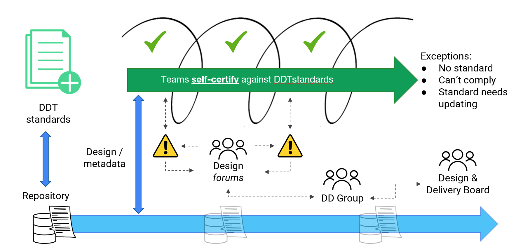

# Design governance

We have different ways of delivering services in DfE. But we always need to ensure that the architecture and design of our services meets the necessary [DDT standards for DfE](https://standards.education.gov.uk).

We want to make sure we're doing the right things (through governance) and doing things right (through assurance). And **not slowing down delivery** in the process.

We use a self-certification, exception-based approach for governance and assurance of design. The core principle being that a team should be able to easily find and apply the [DDT standards for DfE](https://standards.education.gov.uk) in their work. 

Assuming a design complies with the standards, the team should not experience any friction in delivery. Where there is an exception - where there is no standard, it’s not possible to comply with a standard or a standard needs updating – there is a process for agreeing what to do. This might involve a few, or several people, depending on the complexity of the decision to be made.

## Responsibilities and decision-making

The Senior Responsible Owner (SRO) or Service Owner (usually a Deputy Director) is accountable for all delivery within their service, programme, portfolio or division. They rely on the advice of subject matter experts within their multi-disciplinary teams, when taking ownership of key technical decisions and risks in their domain.

The Digital, Data, Technology (DDT) Senior Leadership Team are collectively accountable for strategic design decisions across the organisation, ensuring all cross-divisional or cross-functional impacts are considered. This decision-making is supported by specialists in professional communities.

Everyone is expected to comply with the DDT standards for DfE. Where this isn’t possible or not happening (an exception), a group of specialists may be convened to help guide the team. This can take various forms, but we typically call this a design forum. They would discuss and agree an appropriate course of action for the exception.

In the unlikely event a consensus can’t be reached, escalation to the DDT Senior Leadership Team or DDT Design and Delivery Board may be required.

## How design assurance works in practice

### Self-certification

During each design sprint, the person or team responsible for the design will search the [standards manual](https://standards.education.gov.uk) for principles, standards, patterns or guidance that is applicable to their work. Where these exist, the design would be expected to comply and follow the guidance provided. If compliance is achieved within the design, the delivery team do not need to seek any further approvals. This is self-certification.

The team will also need to determine whether the design will close any existing exceptions. They can do this by searching the [standards manual](https://standards.education.gov.uk). If exceptions do need to be closed, the [DDT standards team](mailto:ddt.standards@education.gov.uk) should be notified.

If not, the delivery team can proceed, and ensure they maintain the design in an appropriate repository for the service.

Where standards or patterns do not exist, then the team are free to design their solution to meet their identified user needs. 

If standards or patterns cover part, but not all, of a design, only the parts within scope of what exists could reasonably be expected to be aligned with. In this instance, the team should consider what *should* exist to cover the gap and discuss this with the [DDT standards team](mailto:ddt.standards@education.gov.uk) to highlight the gap.

Should the need for a new standard, pattern or other artefact emerge during design work, this should also be raised with the [DDT standards team](mailto:ddt.standards@education.gov.uk) for discussion.

### Managing an exception

Where compliance with one or more artefacts cannot be achieved, then an exception should be discussed with the [DDT standards team](mailto:ddt.standards@education.gov.uk) before proceeding with the delivery of the design.

This can result in a number of outcomes, depending on the nature of the exception:

**Minor exceptions**

Where there is a short-term reason not to comply with a standard, or a pre-existing design precludes compliance, this should be discussed with the standard owner.

Considering the nature if the non-compliance and options for how and when the design could be made to comply would likely result in a temporary exception. This will include conditions for the exception - typically, the agreed timescales in which compliance may be achieved, how it would be monitored, or further exception sought. For example, a pre-existing platform choice may be granted exception for a service until it is next due for contract renewal.

**Standard challenge**

Where the standard is considered overly limiting on the design, so intentional non-compliance is likely, the design and reasoning should be discussed with the standard owner. They will consider any concerns and investigate whether the standard is still appropriate, establishing if it needs updating or replacing.

A temporary exception may be applied whilst the standard is reviewed, but this will always carry a constraint that the team will need to align with the updated standard within a prescribed period of time (regardless of whether the standard is changed or not as part of the review).

**Major exception**

Where non-compliance is more significant or complex, the DDT standards team will arrange a review, at pace, pulling in a range of subject matter experts and perspectives to ascertain whether an exception is possible and the conditions that would be applied.

**Exception review**

In all exception cases, there will be a timeframe agreed to reach compliance, in which the delivery team will need to review the exception and update their design. If the design then complies, the team must ensure they update the design in their repository. 

**Where a decision can't be made**

In all cases where the delivery team wish to dispute the terms of an exception or the appropriateness of any specific artefact, and consensus cannot be reached by a design forum, then an escalation process is available. 

This will be facilitated by the DDT standards team, who will escalate to a group of nominated Deputy Directors from the DDT Senior Leadership Team.

If a consensus cannot be achieved at this level, the dispute will be escalated to the DDT Design and Delivery Board for review and a decision.

## Things to help you

DDT professionals and teams have access to a plethora of design skills and experience from across professional communities in DfE. 

You may find it helpful to ask for help with design problems or run a technical show and tell at an [professional community meet-up](#link-to-events-calendar). You can also ask the [Heads of profession](https://educationgovuk.sharepoint.com/sites/lvewp00199/SitePages/Head-of-Professions.aspx) to help facilitate a peer review of your design.

### Peer review

The DDT standards team can help you find the right people to review your design and provide helpful, constructive advice, whatever your stage of delivery. This could be early on when you're thinking about the problem space and options, or later on, when you have physical design.

Typically, you'd have a design and some narrative documented to share in advance of the session - this could be in a form of a simple diagram, design pack or links to technical documentation on your repository/wiki. This gives reviewers the opportunity to understand the context and think of any burning questions about your design beforehand.

During the session, you'll walk through key points of your design, seek and discuss feedback. It should be an open, honest and constructive conversation, amongst trusted peers. You'll be expected to make notes yourself and summarise these (and any actions) back to the group. For particularly large or complex designs, the standards team may be able to provide facilitation/secretariat support.

After the session, the team will need to record and track any significant or cross-cutting decisions and actions.

Contact the [DDT standards team](mailto:DDT.standards@education.gov.uk) to discuss your peer review needs.

### Show and tells

It may be more appropriate for you to bring specialists and team members together for a Show and Tell. These are a great way to provide support, challenge and design assurance in a less formal setting.

Reach out to the respective [Head of Profession](https://educationgovuk.sharepoint.com/sites/lvewp00199/SitePages/Head-of-Professions.aspx) to get a slot at a community meet-up.

## Further guidance

For more information on standards or assuring your design, contact the [DDT standards team](mailto:DDT.standards@education.gov.uk)
