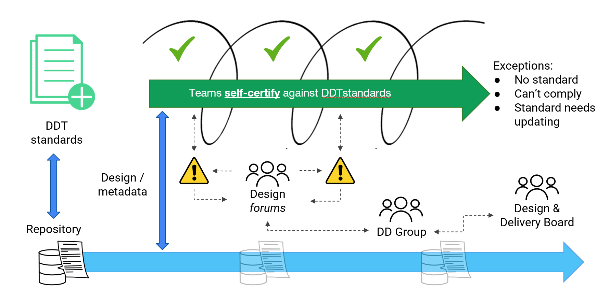

# Design governance and assurance

We have different ways of delivering services in DfE. But we always need to ensure that the technical design of our services meets the necessary [technical standards](../../standards/technical-standards).

We want to make sure we're doing the right things (through governance) and doing things right (through assurance). And **not slowing down delivery** in the process.

We take a self-certification, exception-based approach to design assurance across digital, data and technology. The core principle being that a team should be able to easily find and apply the DfE [technical standards](../../standards/technical-standards) in their work.

Assuming a technical design complies with the standards, the team should not experience any friction in delivery. Where there is an exception - where there is no standard, it’s not possible to comply with a standard or a standard needs updating – there is a process for agreeing what to do. This might involve a few, or several people, depending on the complexity of the decision to be made.

## Responsibilities and decision-making

The Senior Responsible Owner (SRO) or Service Owner (usually a Deputy Director) is accountable for all delivery within their service, programme, portfolio or division. They rely on the advice of technical experts within their multi-disciplinary teams when taking ownership of key technical decisions and risks in their domain.

The Digital, Data, Technology (DDT) Senior Leadership Team are collectively accountable for strategic technical decisions across the organisation, ensuring all cross-divisional or cross-functional impacts are considered. This decision making is supported by technical specialists in professional communities.

Everyone is expected to comply with DfE technical standards. Where this isn’t possible or not happening – an exception - a group of technical specialists may be convened to help guide the team. We call this a *design forum*. They would discuss and agree an appropriate course of action for the exception.

In the unlikely event a consensus can’t be reached, escalation to the DDT Senior Leadership Team or DDT Design and Delivery Board may be required.

## How design assurance works in practice

### Self-certification

During each design sprint, the person or team responsible for the technical design will check for changes to technical standards in [Find and use a Standard](https://standards.education.gov.uk/) and also in relevant architecture repositories for any other artefacts that are applicable to their work - these might be patterns, references or handbooks. Where these artefacts exist, the design is expected to comply and follow the guidance contained in those artefacts. If compliance with artefacts is achieved within the technical design, the delivery team do not need to seek any further approvals. This is self-certification.

_Architecture Repositories_

[Data and Solutions Architecture repository](https://educationgovuk.sharepoint.com/sites/lvewp00391/Lists/DSAAG%20Items/AllItems.aspx?xsdata=MDV8MDJ8fGQyOTI4ZTU4YTc4ZjRmOWVlZDNiMDhkZDgzM2MyYWM2fGZhZDI3N2M5YzYwYTRkYTFiNWYzYjNiOGIzNGE4MmY5fDB8MHw2Mzg4MTEwMTY1OTU0MzQ4MTF8VW5rbm93bnxWR1ZoYlhOVFpXTjFjbWwwZVZObGNuWnBZMlY4ZXlKV0lqb2lNQzR3TGpBd01EQWlMQ0pRSWpvaVYybHVNeklpTENKQlRpSTZJazkwYUdWeUlpd2lWMVFpT2pFeGZRPT18MXxMMk5vWVhSekx6RTVPalptTmpGaFlqWmhMVGswT0RNdE5ERTFaUzA0WkRRM0xXWXpPVE5rWmpWbE9ESm1OMTloTkRGallUWXlNaTB3WVRKaExUUTRNekF0T0dNME15MWxOR1F6T1daaE5HUTJaV05BZFc1eExtZGliQzV6Y0dGalpYTXZiV1Z6YzJGblpYTXZNVGMwTlRVd05EZzFPRGcyTkE9PXxhOGUzNGRlMDc4YmY0MDFlZWQzYjA4ZGQ4MzNjMmFjNnxhYmU1OGJkMWRkMDg0YjU4ODJmNzM5NmU1ODQyZDRkNA%3D%3D&sdata=VHl5WmU3TGFSYnlHbGlRMURBRDNEYUZ4MUphVVBIZFN2RE5tNzhFMVozaz0%3D&ovuser=fad277c9%2Dc60a%2D4da1%2Db5f3%2Db3b8b34a82f9%2CRichard%2EBOLAND%40EDUCATION%2EGOV%2EUK&OR=Teams%2DHL&CT=1745505012167&clickparams=eyJBcHBOYW1lIjoiVGVhbXMtRGVza3RvcCIsIkFwcFZlcnNpb24iOiI0OS8yNTAzMTMyMTAxOCIsIkhhc0ZlZGVyYXRlZFVzZXIiOmZhbHNlfQ%3D%3D)

[Architecture repository](https://educationgovuk.sharepoint.com/sites/gp/artefacts/Forms/AllItems.aspx)

The team will also need to determine whether the technical design will close any existing exceptions. If exceptions do need to be closed, the architecture team should be notified.

If not, the delivery team can proceed with registering the design in the [architecture repository](https://educationgovuk.sharepoint.com/sites/gp/artefacts/Forms/AllItems.aspx).

Where artefacts do not exist, then the team are free to design their solution to meet their user needs. If artefacts cover part, but not all, of a design, only the parts within scope of those artefacts are expected to align with them. In this instance, the team should consider whether there *should* be artefacts to cover the gap and discuss this with the [architecture team](mailto:architecture.profession@education.gov.uk) to highlight the gap.

Should the need for a new standard, pattern or other artefact emerge during technical design work, this should also be raised with the [architecture team](mailto:architecture.profession@education.gov.uk) for discussion.

### Managing an exception

Where compliance with one or more artefacts cannot be achieved, then an exception should be discussed with the [architecture team](mailto:architecture.profession@education.gov.uk) before proceeding with the delivery of the design.

This can result in a number of outcomes, depending on the nature of the exemption:

**Minor exceptions**

Where there is a short-term reason not to comply with a standard, or a pre-existing design precludes compliance, this should be discussed with the [architecture team](mailto:architecture.profession@education.gov.uk).

Considering the nature if the non-compliance and options for how and when the design could be made to comply would likely result in a temporary exemption. This will include conditions for the exemption - typically,the agreed timescales in which compliance may be achieved, how it would be monitored, or further exemption sought. For example, a pre-existing platform choice may be granted exception for a solution or service until it is next due for contract renewal.

**Artefact challenge**

Where the artefact is considered overly limiting on the design, so intentional non-compliance is likely, the design and reasoning should be discussed with the [architecture team](mailto:architecture.profession@education.gov.uk). They will consider any concerns and investigate whether the artefact is still appropriate, establishing if it needs updating or replacing. 

A temporary exemption may be applied whilst the artefact is reviewed, but this will always carry a constraint that the team will need to align with the updated artefact within a prescribed period of time (regardless of whether the artefact is changed or not as part of the review).

**Major exception**

Where non-compliance is more significant or complex, the architecture team will arrange a _design forum_ review, at pace, pulling in a range of subject matter experts and perspectives to ascertain whether an exception is possible and the conditions that would be applied.

**Exception review**

In all exception cases, there will be a timeframe agreed to reach compliance, in which the delivery team will need to review the exception and update their design. If the design then complies, then it will need to be registered in the [architecture repository](https://educationgovuk.sharepoint.com/sites/gp/artefacts/Forms/AllItems.aspx), once agreed with the architecture team. 

**Where a decision can't be made**

In all cases where the delivery team wish to dispute the terms of an exception or the appropriateness of any specific artefact, and consensus cannot be reached by a technical design forum, then an escalation process is available. 

This will be facilitated by the architecture team, who will escalate to a group of nominated Deputy Directors from the DDT Senior Leadership Team.

If a consensus cannot be achieved at this level, the dispute will be escalated to the Design and Delivery Board for review and a decision.

## Things to help you

Architects and teams have access to a plethora of design skills and experience from across professional communities in DfE. 

You may find it helpful to ask for help with design problems or run a technical show and tell at an architecture community meet-up. You can also ask the [architecture team](mailto:architecture.profession@education.gov.uk) to help facilitate a peer review of your design

### Peer review

The architecture team can help you find the right people to review your design and provide helpful, constructive advice, whatever your stage of delivery. This could be early on when you're thinking about the problem space and options, or later on, when you have physical design.

Typically, you'd have a design and some narrative documented to share in advance of the session - this could be in a form of a passport, design pack or links to technical documentation on your repository/wiki. This gives reviewers the opportunity to understand the context and think of any burning questions about your design beforehand.

During the session, you'll walk through key points of your design, seek and discuss feedback. It should be an open, honest and constructive conversation, amongst trusted peers. You'll be expected to make notes yourself and summarise these (and any actions) back to the group. For particularly large or complex designs, the profession may be able to provide facilitation/secretariat support.

After the session, the architecture team will record and track any significant or cross-cutting architecture decisions and actions.

Contact the [architecture team](mailto:architecture.profession@education.gov.uk) to discuss your peer review needs.

### Technical show and tells

It may be more appropriate for you to bring architects and team members together for a technical Show and Tell. These are a great way to provide support, challenge and design assurance in a less formal setting.

Contact the [architecture team](mailto:architecture.profession@education.gov.uk) to get a slot at a community meet-up.

### Templates

> There are currently no set standards for documenting technical design. The following templates and examples are no longer in use, however, they do provide some guidance and may help you to develop your design.

- [Design pack, with example diagrams](../documents/design-pack.docx)
- [Design pack, text only](../documents/design-pack-just-text.docx)

## Further guidance

For more information on technical governance or assuring your technical design, contact the [architecture team](mailto:architecture.profession@education.gov.uk)
