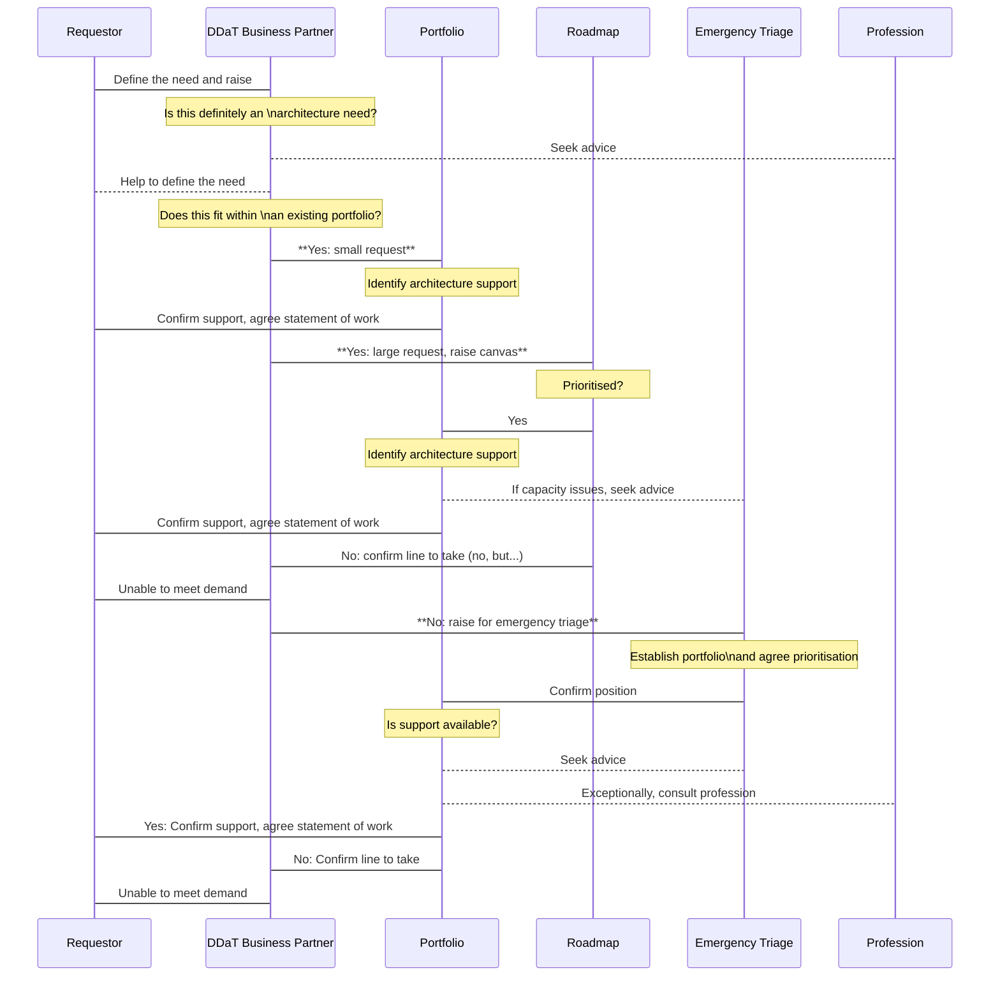

# Get help with architecture
> This is a prototype of a process flow to help everyone understand the steps involved in securing architecture support for your project.
> It will be used to test the steps with the actors involved, to then iterate and refine the process.
> Any comments to the [architecture profession mailbox](architecture.profession@education.gov.uk) please.

