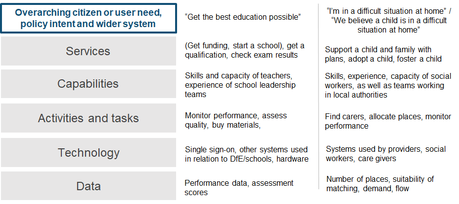
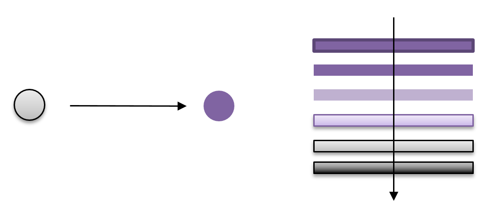
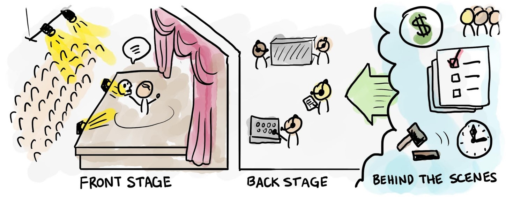
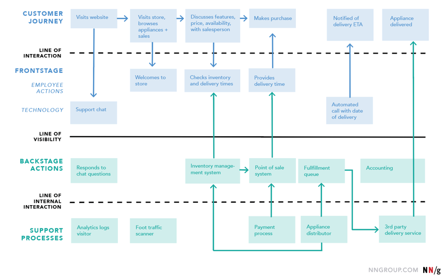

# Common definitions

## How we talk about services in DFE

Our goal is to create a common set of definitions, to help us talk about services and understand what’s meant by them in the Department for Education (DfE).

It takes time to understand what everyone means when they say words like - service, product, user need, platform, channel, capability, architecture, policy, data and strategy - as we all have our own definitions.

The value in a common set of definitions is not so much in what the actual words are, but the fact that we made this together as a multi-disciplinary group, and that we all agree to try it out.

This will enable us to have better discussions, spot commonalities, think about design patterns and organise large portfolios of work more easily. It also provides a language to communicate how things could work differently in future.

It is also important to understand the different roles involved in using a common set of definitions.

### Who is this for?

This set of definitions is aimed predominantly at people working in digital, data and technology service delivery teams in DfE. We also hope that colleagues in teams across the wider department will find these definitions useful, to understand a little more about digital, data and technology services.

Think of this resource as our dictionary of terms.

## Different levels of work

The kind of work we do might be around creating a new service or optimising parts of how an existing service works. Equally, it could be around influencing a larger programme of work or procurement or contract, that has the ability to improve (or risk negatively impacting) parts of a service in its scope.

Here is a high-level view of some of our common definitions, with some examples of the levels of work:

## Terms and definitions

The terms we use in the different levels of work may have different meanings or connotations, dependent on your or your user's perspective. We’ve tried to make these definitions as generic as possible without losing meaning, or have provided contextual examples to help give meaning.

- [Activities and tasks](#activities)
- [Capability](#capability)
- [Common component](#common-component)
- [Data](#data)
- [DDaT / DDT](#ddat)
- [Feature](#feature)
- [Organisation](#organisation)
- [Platform](#platform)
- [Product](#product)
- [Service](#service)
- [Register](#register)
- [Roles](#roles)
- [Technology](#technology)
- [Value Stream](#values)

### Activities and tasks ###

Activities and tasks are the things people do in relation to using a service, including:
- finding out how something works
- calling people for help
- applying for something
- gathering evidence
- waiting and worrying about what might happen
- being notified about a result
- calling to find out what’s happening

Activities can also describe the things that need to happen to make a service work, whether by people or by computers, for example, to achieve an outcome, such as:
- checking eligibility
- checking suitability
- making a decision
- notifying someone about a decision
- revoking permission

Activities should describe what happens, but not how it happens, by whom or with what. So, we’d use ‘notifying someone’ rather than ‘sending a letter’ and ‘making a decision’ rather than ‘casework’.

For example, a claims advisor deciding how much someone’s insurance claim is worth (activity) may use several systems to look-up data about the individual (tasks).

### Capability ###

A capability is an abstract concept, used to describe what we do (but not how). Capabilities can be thought of as all the things we do to deliver on our goals and are realised by people, processes, information, technology and other things – they help us consider whether we have all the expertise, knowledge, tools, organisation and capacity to do it.

Capabilities can be grouped together into families or categories, for instance:
- business capabilities, that describe core activities an organisation does to achieve its goals.
- enabling capabilities, that, in of themselves, do not directly deliver organisation goals but rather support other capabilities, and might be shared or centralised.

Capabilities can also be decomposed into levels to show more detail, usually to no more than 3 levels.

The DfE might define an organisational need to deliver Curriculum Design (a business capability). This will require people, processes, information, technology and other things. These may in turn rely on other capabilities, such as communications or finance, to support their delivery (enabling capability).

### Common components ###

A common component is a software or technical system that is created once and reused many times in different services or business contexts. They are building blocks, typically mapped to a business or technical capability, which can be used to deliver modular services or systems of a higher order.

Components are often used alongside design patterns. A pattern describes a general, reusable solution to a commonly occurring problem, within a given context.

Common Components can be of any size but they all share the same characteristics. They are:
- designed according to common standards, principles and patterns, with independent quality assurance to ensure the principles and patterns have been applied.
- designed and developed in a modular, scalable and resilient way to support ease of reuse and reliability.
- mapped to a specific business or technical capability/service. This enables easy search and prevents duplication.
- treated as an asset and therefore require asset lifecycle management – support wrap, continuous improvement, enhancement or replacement.
- standalone but interoperable with other common components, such that change to one does not cause a ripple effect change to others.

In a mature organisation, common components allow us to build services and products more quickly - reusing common elements from other services (such as a ‘login’ element), rather than recreating it multiple times, in multiple ways.

Some examples of common components in DfE are [DfE Sign-in](../../common-components/#dfe-sign-in), providing identity and access management, and the [Enterprise Data and Analytics Platform (EDAP)](../../common-components/#enterprise-data-and-analytics-platform), for strategic data management.

Read more on the [common components guidance](../../common-components).

### Data ###

By data, we mean the actual information that’s either generated by or used to carry out activities and services. We try to describe what the data actually is using descriptive words, such as ‘National Insurance number’, and avoid acronyms.

Data can be thought of in two ways, operational data, which is generated by the operation of a service. An example would be user completion rates on a digital service.

The second can be thought of as intelligence. Data that we consciously generate in order to make decisions. Some might consider this to be information - data that has been ordered or analysed and provides meaning, more than purely the data alone. An example might be customer satisfaction or census data. We ask a conscious question from our users, in order to generate meaning.

Data can sometimes be provided as a service for internal or specialist end users, for example, through registers or other databases, Application Programming Interfaces (APIs), standards and permission or usage based controls.

### DDaT / DDT ###

Digital, Data and Technology (DDaT) was re-branded as Government Digital and Data in 2023. It is a profession in the UK Civil Service, spearheaded by GDS and characterised by the [Government Digital and Data Profession Capability Framework](https://ddat-capability-framework.service.gov.uk/).

Digital, Data, Technology (DDT) is a term used within DfE to describe the collective community of people working in data, digital and technology roles across the department.

### Feature ###

Features are specific activities or tasks (outcomes) that services or products can deliver. Certain features might be differentiating factors between services and products; they might help you decide which is the right product for you to use.

For example, features common to popular collaboration software products, like Teams, might include things like video conferencing, voice calling, chat or instant messaging. Similarly, the 'Discover your skills and careers' product within the National Careers Service has a job search feature, with which users can drill down into the details of different jobs, to help them understand if that's a good career choice for them. This differs from a job search feature on a recruitment website, for example, that displays live vacancies for a particular job. These are different features.

### Organisation ###

An organisation is an entity structured to achieve a range of objectives. For DfE these objectives are most likely to be outcomes associated to policy or the value DfE attempts to deliver.

Organisation structures are most often represented in ‘map’ format showing relationships and flow between organisational units.

Organisation maps should not be confused with organisation trees which are primarily concerned with hierarchies and reporting lines.

Organisation maps are unlikely to be used in isolation and are most often created alongside mapping and modelling of capabilities, value streams and other such collateral to aid understanding and improved decision making.

### Platform ###

A platform is something you can build a product or service upon. Platforms are typically groups of technologies that, collectively, provide the basis on which applications, products, services, processes can be built.

Examples of technology platforms in use within DfE include the [Cloud Infrastructure Platform (CIP)](../../common-components/#cloud-infrastructure-platform) and the [Find and Use an API platform](../../common-components/#fauapi).

The Government Digital Service (GDS) offer [Government as a Platform](https://gds.blog.gov.uk/category/government-as-a-platform/) services, described as 'common core infrastructure of shared digital systems, technology and processes on which it’s easy to build brilliant, user-centric government services. Examples include GOV.UK Pay and GOV.UK Notify.'

### Product ###

A product is a thing that helps to meet one or more user needs. A digital or technology product is usually a piece of software.

Products can vary in size and can be grouped together and integrated to create a service. Typically, a service is a larger collection of products which are grouped together to help a user to achieve an outcome.

An example is the 'Discover your skills and careers' product, within the National Careers Service. It's a standalone product but is best consumed as part of the user journey across the wider service. This helps a user achieve the outcome of defining a career path and developing their skills to be successful in that career.

Some examples of technology products, used to enable a service, might be Microsoft Dynamics 365 or Salesforce. These are Commercial-Off-The-Shelf (COTS) products that, amongst other things, provide Customer Relationship Management (CRM) capability.

### Service ###

We describe a whole service as:

_“everything the user needs to do to achieve a goal. It is the end-to-end journey that helps a user to achieve something, e.g. from thinking about a career in teaching, to stepping into a classroom as a newly qualified teacher, from start to finish.”_

The whole service is defined from the user’s perspective, rather than from ours.  That's why, in government, it's standard practice to name services by how a user would think of them or search for them online - for example, ‘get a passport’, ‘become a teacher’, ‘learn to drive’ or ‘become an apprentice’.

In DfE, a user could be a student, a teacher, a parent or guardian, a child, an external training provider, a civil servant - anyone that needs to do something, where they or government has a particular outcome to achieve.

A service is a collection of 'things' that users interact with that help them achieve their goals. As a result, a service entails an ongoing and consistent relationship between an organisation and its users. ‘Things’ could be, for example, digital products, call centres that offer support, business processes, communications, interaction with users - any constituent part of a whole service.

Important things to know about a service:
- They come and go
- They have a life cycle
- 'Digital' is just one aspect of the service
- Services are continuously improved
- Services deliver policy outcomes

Services work:
- _End-to-end_ : from where a user starts to explore and understand what they have to do, to the achievement of the goal that they set out to complete
- _Front-to-back_ : from where users are interacting with the service through some kind of touchpoint (face-to-face, online, phone or other), to the behind the scenes processes and systems that support them, and finally the things hidden from the user but essential to the service, such as governance and financial management aspects

It can be helpful to think about these elements like a performance, with things going on in front of and behind the curtain, plus everything 'behind the scenes' to make sure the production can go ahead.

People often describe a map of all these things as a 'service blueprint'.

Every service should have an owner who is accountable for improving the service, managing the day to day operations of the service and ensuring it continues to deliver value to its users and the organisation.

We sometimes refer to *internal* services - those that support the running of the department, such as Finance, Commercial or HR services - and *external* services - those that DfE provides to its external users, like learners, teachers and schools, for example, the Apprenticeships Service or Teacher Vacancies Service.

For more insight into services, have a look at the _#serviceowners_ and _#servicedesign_ channels on [DfE Slack](https://ukgovernmentdfe.slack.com).

### Register ###

We define a register as the single place to find authoritative information on a single subject or domain. A register must have a data controller or steward who is responsible for ensuring the information contained on a register is kept up to date, accurate and accessible.

For example, the Foreign and Commonwealth Office (FCO) maintains a register of countries. It is a single, maintained list of countries. Any service can connect to this register to provide a single, consistent and authoritative list to its users.

Technology maintain a register of all Services, Products, Technology and Platforms, called the Configuration Management Database (CMDB).

## Roles ##

We’re conscious that definitions of the roles involved in creating and maintaining services can sometimes be confusing - for example, does the Service Owner of a public-facing service have the same responsibilities as a Service Owner for an internal DfE service?

Associated roles are defined in the [Government Digital and Data Profession Capability Framework](https://ddat-capability-framework.service.gov.uk/) and may feature as part of our common definitions in the future.

### Technology ###

Technology covers the systems, tools, platforms and applications we build, maintain and buy. Technology exists to support products, activities and capabilities, enabling us to deliver faster, clearer, simpler services.

For example, a cloud hosting platform would be considered a particular type of technology.

### Value Stream ###

A value stream is a high-level representation of how an organisation creates value for its stakeholders. For the public sector value might also be thought of as an outcome and is most often associated with policy aims and objectives.

Value streams are sequences of activities that when actioned enable an organisation to deliver value.

Value streams are often represented in ‘map’ format showing relationships and flow between activities.

Value streams are most often created as part of activities to describe an organisation to aid understanding and improved decision making.

## Get in touch ##

We'd love to hear your thoughts or any feedback on these definitions - please contact [Luke Slowen](https://eur.delve.office.com/?u=fa01b414-9e39-4740-ab85-0ef228e3f7e7&v=work), [Ushma Gill](https://eur.delve.office.com/?u=976f27df-5486-4d6a-8afd-b46f95453e70&v=work) or [Paul Brown](https://eur.delve.office.com/?u=ce9e74df-d602-437b-89a4-37bd876dbaf2&v=work).
